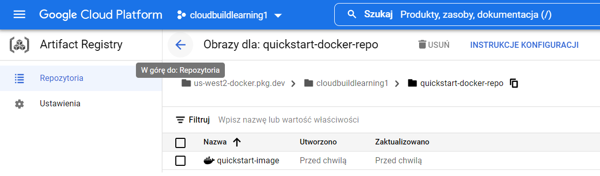

<!--Category:react,firebase--> 
 <p align="right">
    <a href="http://productivitytools.tech/"><a> 
    <a href="https://github.com/pwujczyk/ProductivityTools.Learning.GCP.CloudBuild1"></a>
</p>
<p align="center">
    <a href="http://http://productivitytools.tech/">
        
    </a>
</p>


[Source tutorial](https://cloud.google.com/build/docs/build-push-docker-image)

File which will go to docker. quickstart.sh
```sh
echo "Hello, world! The time is $(date)."
```

Dockerfile:
```dockerfile
FROM alpine
COPY quickstart.sh /
CMD ["/quickstart.sh"]
```
As I am on windows I haven't run
```
chmod +x quickstart.sh
```
### Create a Docker repository in Artifact Registry
```
gcloud artifacts repositories create quickstart-docker-repo --repository-format=docker --location=us-west2 --description="Docker repository"

gcloud artifacts repositories list
```

### Building the docker image
```
gcloud builds submit --region=us-west2 --tag us-west2-docker.pkg.dev/cloudbuildlearning1/quickstart-docker-repo/quickstart-image:tag1
```



## Build an image using a build config file

### yaml

- name - public available docker image.  
```
steps:
- name: 'ubuntu'
  args: ['echo', 'hello world']
```

Supported images provided by google:
- gcr.io/cloud-builders/bazel
- gcr.io/cloud-builders/docker
- gcr.io/cloud-builders/git	
- gcr.io/cloud-builders/gcloud	
- gcr.io/cloud-builders/gke-deploy	
- gcr.io/cloud-builders/gradle	
- gcr.io/cloud-builders/mvn	
